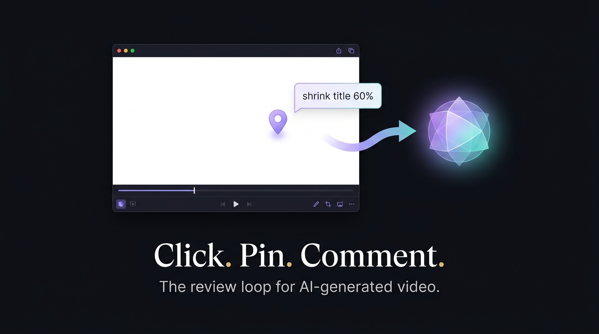
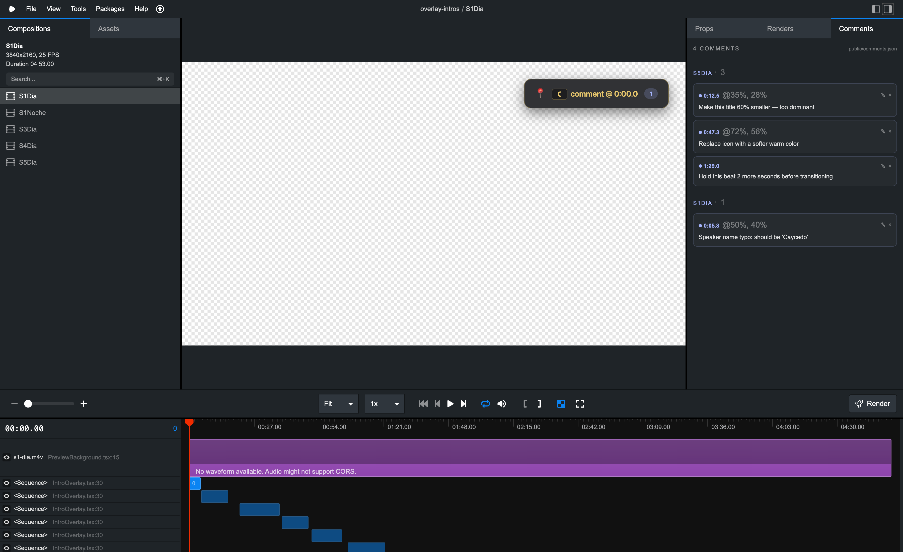

<div align="center">



# remotion-comments

**Click on the video. Drop a pin. Tell the AI what to change.**

[](https://www.npmjs.com/package/remotion-comments) · [](LICENSE) · [GitHub](https://github.com/mario-hernandez/remotion-comments)

</div>

---

## What is this?

You let an LLM (Claude Code, Cursor, Gemini CLI…) generate videos with [Remotion](https://www.remotion.dev). It works — until you watch the result and want to change something at minute 2:13.

Today that means switching to chat and typing *"hey, at minute 2:13, the title in the upper-right is too big — shrink it"*. The AI has to **guess** which composition, which frame, which element. Half the time it doesn't know what "upper-right" means.

`remotion-comments` makes feedback **a click on the video**:

1. You click on the title in the preview.
2. Type *"shrink to 60%"*. Press Enter.

A file `public/comments.json` now contains:

```json
{ "compositionId": "MyVideo", "atSec": 23.4, "posX": 62.3, "posY": 31.0, "text": "shrink to 60%" }
```

The AI reads it. It knows **which composition**, **which frame**, **which pixel**. It applies a precise change.

That's the whole product.

---

## In Remotion Studio it looks like this



A new **`Comments`** tab next to *Props* and *Renders*, with all your notes grouped by composition. Each one jumps you to its frame on click. You can edit, delete, or — better — let the LLM read the JSON and act on it.

Each comment also appears as a **named clip on the official Studio timeline** (`💬 shrink to 60%`).

---

## How to use it

You only need three things:

1. **A Remotion project** (already running `npx remotion studio`).
2. **An AI assistant in your terminal** (Claude Code, Cursor, Gemini CLI…) that can read files and edit code.
3. **`remotion-comments` installed.**

### Install

```bash
npm install remotion-comments
```

### Add it to your composition

```tsx
import { CommentsPanel, CommentSequences } from "remotion-comments";

export const MyComposition = () => (
  <AbsoluteFill>
    {/* …your scene… */}
    <CommentsPanel compositionId="MyVideo" />
    <CommentSequences compositionId="MyVideo" fps={30} />
  </AbsoluteFill>
);
```

### Activate the sidebar tab (one-time, see [why](#about-the-studio-patch))

```bash
mkdir -p patches
cp node_modules/remotion-comments/patches/@remotion+studio+*.patch patches/
npm install --save-dev patch-package
npm pkg set scripts.postinstall="patch-package"
npm install
```

That's it. Open Studio. Click on the preview. Drop pins.

---

## When you're done reviewing

Tell your AI assistant:

> Read `public/comments.json` and apply each comment as a code change.

It opens the file, sees the `(compositionId, atSec, posX, posY, text)` of each note, and goes to the right `<Sequence>` in your code. Job done.

---

## Keyboard

| Key | Action |
|---|---|
| Click on preview | Drop a pin at that pixel + current frame |
| `C` | Open form anchored to current frame (no spatial pin) |
| `Enter` | Save comment |
| `Shift+Enter` | Newline |
| `Esc` | Cancel |

---

## What gets stored

Plain JSON in `public/comments.json` — git-friendly, diff-able, AI-readable:

```json
[
  {
    "id": "a3b9c1d2",
    "compositionId": "MyVideo",
    "atSec": 23.4,
    "posX": 62.3,
    "posY": 31.0,
    "fps": 30,
    "text": "shrink to 60%",
    "createdAt": 1730000000
  }
]
```

| Field | Meaning |
|---|---|
| `compositionId` | which `<Composition id="…">` |
| `atSec` | when on the timeline (seconds) |
| `posX`, `posY` | where on the frame (% of width/height). Absent if added with the `C` shortcut |
| `fps` | composition fps. Used to seek the right frame |
| `text` | free-form note |

---

## Building your own UI on top

If you want a custom panel, the `useComments()` hook gives you everything:

```tsx
import { useComments } from "remotion-comments";

const Sidebar = () => {
  const { comments, add, update, remove, byComposition } = useComments();
  // …your UI…
};
```

---

## About the Studio patch

Remotion Studio's right sidebar (`Props` / `Renders`) is hardcoded — it does not yet expose an extension API for third-party tabs. So enabling the `Comments` tab requires a tiny [23-line patch](patches/) to the compiled `@remotion/studio` package, applied automatically by `patch-package` after every `npm install`.

A proper extension API for the Studio is being proposed upstream: [`registerStudioPanel({id, label, component})`](https://github.com/remotion-dev/remotion/issues). Once accepted, the patch will be deprecated. The rest of the package (`<CommentsPanel/>`, `<CommentSequences/>`, `useComments()`) will keep working untouched.

If you don't want to patch Studio, the in-preview UI (`<CommentsPanel/>`) and the timeline clips (`<CommentSequences/>`) work without it. You just lose the dedicated sidebar tab.

---

## Compatibility

- Remotion `4.0.448+`
- React `18+`
- Node `18+`

---

## License

MIT © Mario Hernández — [contribute on GitHub](https://github.com/mario-hernandez/remotion-comments)
